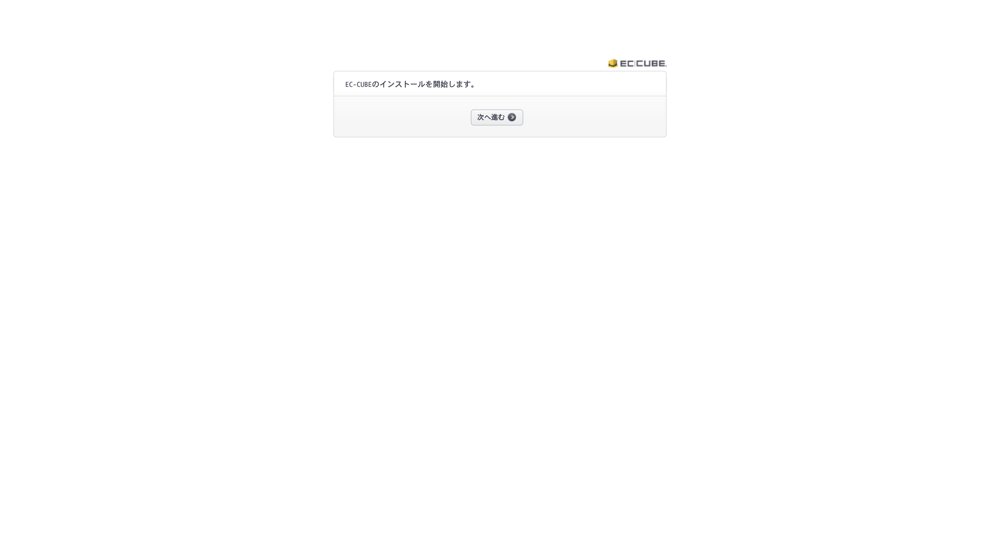

# WebLife Japan Inc. 
<div align="center">
<a href="https://www.web-life.co.jp/"></a>
</div>

### EC-CUBEによる環境構築  

## EC-CUBEの概要  

>日本企業の株式会社ロックオンが提供している、ECサイト構築パッケージの名称です。日本発で、シェアは国内NO.1のオープンソースのソフトウェア
引用元：https://www.kagoya.jp/howto/netshop/ec-cube/

## メモ、気になった事  
EC-CUBEとはECサイトを作るための構築パッケージであるという事、Symfonyで作られている。  
カスタマイズする事で独自のサイトを構築できる。  
テンプレートエンジンがtwigを使用している。  
フロントも含めカスタマイズ可能なので業務といたしてはお客様の要望を聞きながら機能拡張実装を行う物だと思う。  
PostgerSQL MySQL SQLiteから選択可能である。  
mailサーバーを構築することも可能である。  

## インストール方法 for EC-CUBE4.0 
開発者向けドキュメントサイトより  
1. まずはcomposerをコマンドラインよりインストール  
```
brew install homebrew/php/composer
```
2. EC-CUBEのプロジェクトを作成  
```
php composer.phar create-project ec-cube/ec-cube ec-cube "4.0.x-dev" --keep-vcs
```
3. ディレクトリに移動してビルトインウェブサーバを立ち上げる。  
```
bin/console server:run
```
4. デフォルトで用意されているデモサイトが表示される。 
<div align="center">
  
</div> 

## インストール方法 for EC-CUBE2.17  
https://github.com/EC-CUBE/ec-cube2　より  
```
git clone https://github.com/EC-CUBE/ec-cube2.git
cd ec-cube2
php -r "copy('https://getcomposer.org/installer', 'composer-setup.php');"
php composer-setup.php
php -r "unlink('composer-setup.php');"
php composer.phar install --no-dev --no-interaction -o
```
Herokuへデプロイ  
```
heroku create
```
1. EC-CUBEのインストール画面へ  
<div align="center">
  
</div>  

2. 今までフレームワーク上でしかデータベースを作成してこなかった。  
SQLを使ってDBを作成する為理解を深めている、ここでストップしている状態

## error
- 4系のEC-CUBEセットアップ完了後に bin/console server:run が実行できなくなる（There are no commands defined in the "server"）

突然ビルトインサーバーを立ち上げる事ができなくなった。  
APP_ENV変数をproductionからdevelopmentへ変更する事で立ち上げる事ができた。  
理由や原因がわからなかったのでその辺りを調べなければいけないと思う。

## 今後の課題  
今まではHerokuやEC2にアプリをデプロイしてきたが、作成したアプリを公開するに当たってどこから手を付ければ良いかわからなかった。  
WebサーバーはApacheを使って、DBはどれを使うか？
SQLはどうやって書けば良いか？  
httpd.confにどのように記述すれば良いか？  
フレームワークを使ってアプリケーションを作成する知識は少しは身についたと思うが、Webサーバーの知識、データベースの知識が明らかに足りていないので理解を深めていかなければいけないと思います。  

